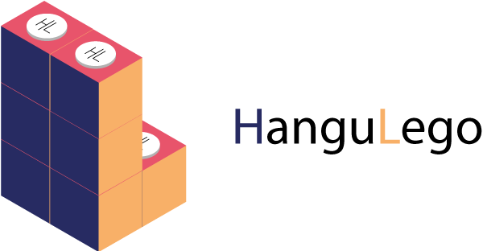
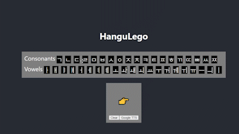

  

Learn hanguls(Korean letter) like stacking LEGO. Reinforce your memory every time you drag a brick.

## Features

  

* Drag and drop to assemable hangul

    `react-dnd` ships the dragging mechanism. 
    Dragging over clicking strengthen the memory about hangul. Mobile dragging could be fulfilled with `touch-backend`

* Hangul pronunciation reinforce your memory

    Pronunciation scrapped from _90 Day Korean_, word pronunciation take the advantage of _Google Translate_ (Could also try Chrome builtin `SpeechSynthesisUtterance`)

* Colorful brick highlighting hangul structure
    
    TODO

* Learning progress tracking (possibly?)

    Future maybe 😎

## Design Concept
The crafting of this tool roused during my journey of self-taugt Korean. 
According to Sejong the Great(creator/compiler of Hangul), 

> "A wise man can acquaint himself with them before the morning is over; a stupid man can learn them in the space of ten days."

, but after a month, I  couldn't memorise hangul. 

Instead of giving up or switching to hangul romanization, I came up with an idea, make a tool that help reinforcing hangul's pronunciation. 

I took the concept of LEGO, when ever I want to search a word, I need to drag consonants and vowels to construct the Korean word. HanguLego will speak out the pronunication of the hangul you're dragging.

Since the Hangul structure is scientific, adding colors to different parts of hangul that compose a word may be helpful for memorising the word.
Keep in mind that HanguLego is not meant to be a dictionary, but a learning tool that help you conquer the Korean Learning Advantage.

Once I find any useful learning tracking approach, HanguLego could be equipped with progressing feature, feel free to reach out if you have any ideas!

## Usage
Clone the project and `npm start` to run locally or try it on [Carryou](https://hangulego.carryou.dev/)

## Learn More

You can learn more about my language learnign ideas 👉 [To Learn Korean I Made a Game](https://www.youtube.com/watch?v=7syJnOKJQAQ).
